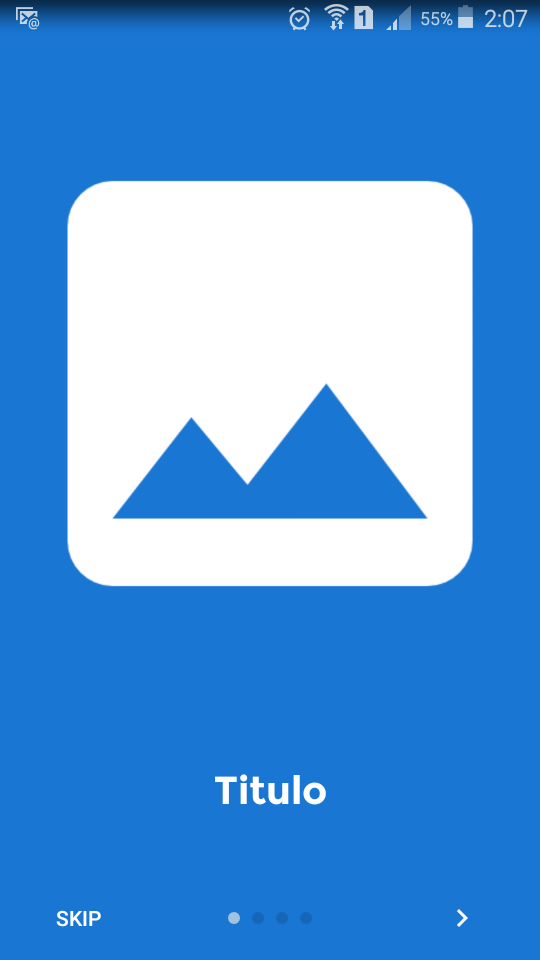
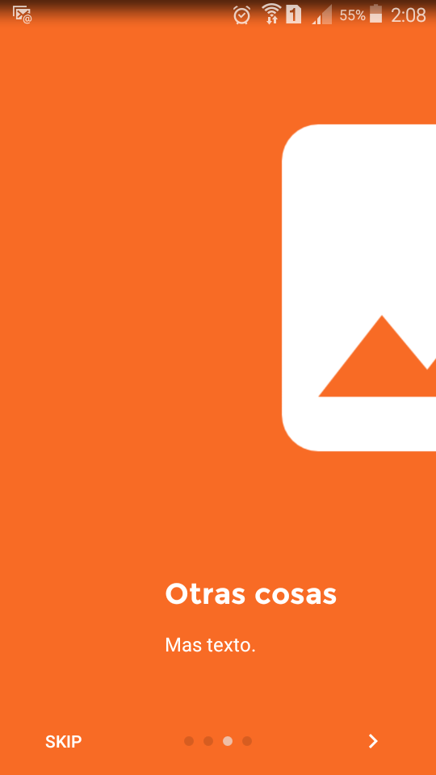
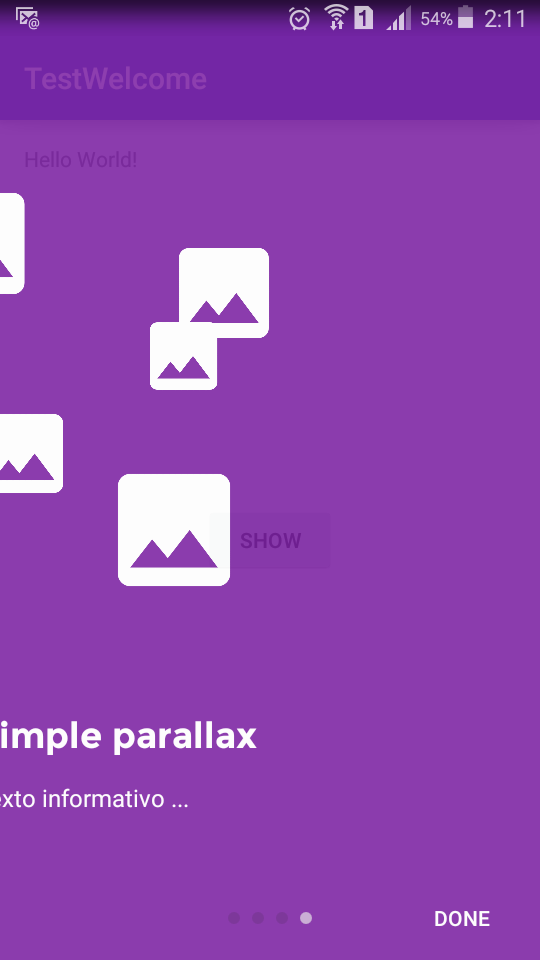

# Descripcion
Esta es una simple prueba de inicio y bienvenida de una app

El codigo original de la libreria se encuentra en el siguiente enlace de GitHub
[GitHub](https://github.com/stephentuso/welcome-android)
##Inicio

###Social
- Twitter [@AldoGamaliel](https://twitter.com/AldoGamaliel)

- Google+ [+Aldo Estrada](https://plus.google.com/u/0/+AldoEstrada1992)